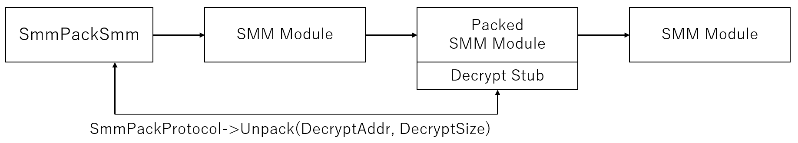
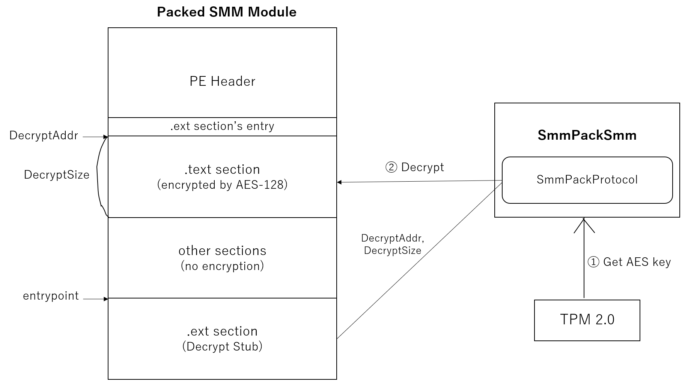
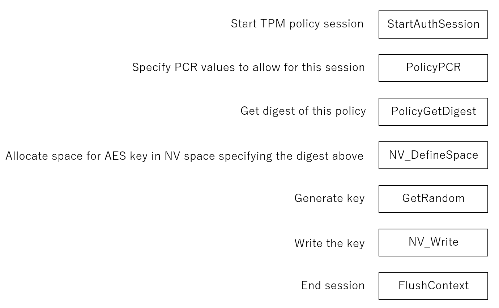
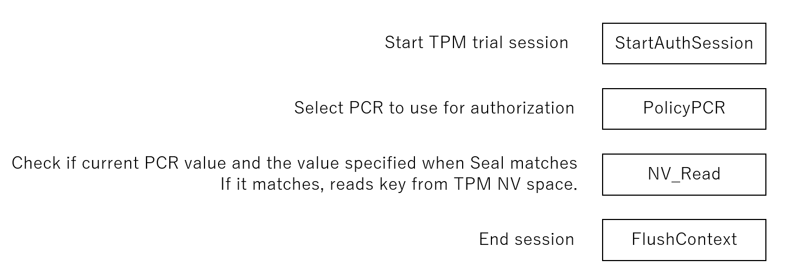

# UefiPack
Encrypts UEFI Modules (DXE driver and SMM modules) by AES-128 using key sealed in TPM2.0 device.  

 

## Components Description
* UefiPackPkg (edk2)
	* UefiPackDxe: Retrive TPM key and provides UefiPackProtocol for unpack
	* UefiPackSmm: Retrive TPM key and provides UefiPackSmmProtocol for unpack
	* SealKeyDxe: Seal key to TPM (PCR value can be read by using UefiPackDxe/UefiPackSmm)
	* TestDxe: Sample DXE driver for testing
	* TestDxe: Sample SMM module for testing
* UefiPackPacker (VS2019)
	* dxe-packer.cpp: Packs DXE driver which can be unpacked by UefiPackDxe
	* dxe-packer-automated-addresss-shift-ghidra.cpp: Packs DXE driver and shift address of protocol functions (requires ghidra+efiseek)
	* smm-packer.cpp: Packs SMM module which can be unpacked by UefiPackSmm
	* bootloader-packer-fail.cpp: Supposed to pack boot loader/boot manager (such as bootmgfw.efi) but currently not working
	* main.cpp: Copy the contents of one of the code above and compile to build a packer executable

 

## Building

### UefiPackPkg
1. Setup edk2
2. Copy `UefiPackPkg` as `edk2/UefiPackPkg`
3. In `edk2/Conf/target.txt`, edit `ACTIVE_PLATFORM` to `UefiPackPkg/UefiPackPkg.dsc`
4. Select which modules to build by editing `UefiPackPkg/UefiPackPkg.dsc`
5. `build`

### UefiPackPacker
1. open UefiPackPacker.sln with Visual Studio 2019
2. copy either dxe-packer.cpp or smm-packer.cpp to main.cpp
3. make sure to rewrite the key with your key sealed in TPM
4. `Ctrl-b` to build

Note that after packing with dxe-packer.cpp or smm-packer.cpp, if the packed DXE/SMM modules installs any protocol, the function address of protocol interface structure must be manually shifted. This process is included/automated in dxe-packer-automated-address-shift-ghidra.cpp, but this requires ghidra+efiseek environment and changing the path in the source code.

 

## Description

### 1: Overview

  

UefiPackPacker packs DXE drivers or SMM modules by AES-128 before BIOS deployment. When executing packed modules, they decrypt themselves by using UefiPackProtocol's Unpack function which will be provided by UefiPackDxe or UefiPackSmm.  
UefiPackDxe and UefiPackSmm should be executed early in the DXE phase. You can add GUIDs of UefiPackDxe and UefiPackSmm in the Apriori file.

### 2: Unpacking

    

Most UEFI modules running at DXE and after are in PE format. UefiPackPacker will encrypt .text section of DXE driver or SMM module by AES-128 and adds Dcrypt Stub (.ext section) to decrypt it. By passing DecryptAddr (.text section's base address) and DecryptSize (.text section's size) to UefiPack(Smm)Protocol's Unpack function, it will decrypt the .text section using AES key stored in TPM2.0.

### 3: Key Sealing
Key should be sealed into the TPM beforehand. Sealing is the TPM feature to restrict the access towards TPM data using PCR. By doing this, key cannot be read above OS or from other bootphases which avoids key to be theft. About further explanation of PCR, you can refer to my [other post](https://dev.to/machinehunter/reading-pcr-value-from-uefi-4a82).

  
Above is the TPM command used to seal the key into TPM. Key is stored in the NV space of TPM (named NV Index) and restriction of read/write towards the key is actually the restriction towards this NV Index which the key is tored. You have to specify what PCRs are used and their digest value at PolicyPCR command. In this way, you can restrict the key (NV Index) to be only readable when PCR is in specific value.

This Sealing can be done using SealKeyDxe, but you have to read your platform's PCR value using UefiPackDxe's `TpmPcrRead()` and set the digest of that value to SealKeyDxe's `TpmPolicyPCR()`.

### 4: Reading the Sealed Key
  
Key reading process is done in UefiPackDxe/UefiPackSmm's `DriverEntry`. UefiPackDxe/UefiPackSmm first reads the key value by sending above 4 TPM commands and then, installs **UefiPack(Smm)Protocol** which contains `Unpack` function for packed modules to decrypt itself. Because the key is sealed into the TPM, you have to start policy session by `StartAuthSession` and specify PCR to use by `PolicyPCR`. Then, the PCR values are check at `NV_Read` under the session, and if it matches, keys are read successfully.
